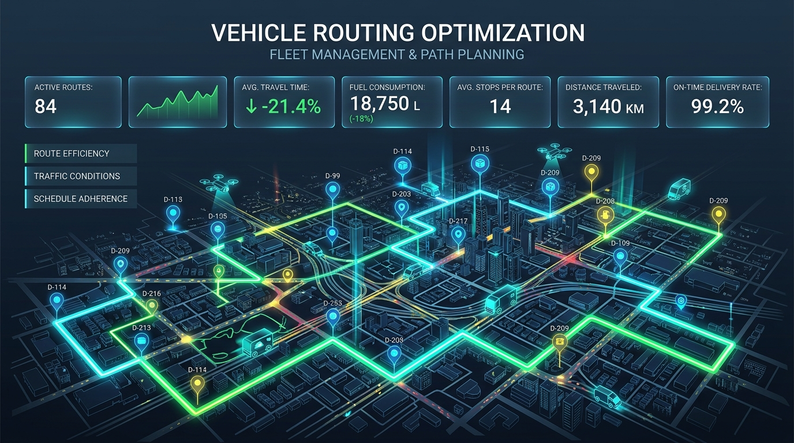
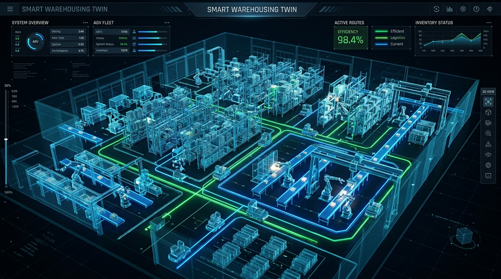

# NVIDIA cuOpt
### GPU-Accelerated Decision Optimization

Accelerate vehicle routing, supply chain routing, and mathematical scheduling with world-record speed.

---

## The Core Challenge: Decision Bottlenecks

*   **Complexity:** Real-world logistics, scheduling, and finance problems have millions of variables and constraints.
*   **Latency:** Traditional CPU-based solvers (LP, MILP) take hours to run, making real-time, dynamic adjustments impossible.
*   **Cost:** High compute time translates directly to elevated operations cost and fuel waste in delivery networks.

---

## What is NVIDIA cuOpt?

NVIDIA® cuOpt™ is an open-source, GPU-accelerated optimization engine.

*   **Mathematical Models:**
    *   *Linear Programming (LP/PDLP)*
    *   *Mixed-Integer Linear Programming (MILP/MIP) [Beta]*
    *   *Quadratic Programming (QP)*
*   **Routing Specialization:** Fully optimized for Traveling Salesperson (TSP) and Vehicle Routing Problems (VRP) with capacities and time windows.

---

## Hybrid GPU/CPU Primal Heuristics

*   **GPU Parallelization:** Runs **primal heuristics** (like *Feasibility Pump/Jump* and *Fix-and-Propagate*) across thousands of GPU cores to locate feasible points instantly.
*   **CPU Tree Search:** Combines with CPU solvers to perform dual bounding and branch-and-bound searches.
*   **The Result:** Up to **5,000x speedup** on large LP problems and faster gap reductions on MIPs.

---

## Real-World Use Cases: Logistics & Routing

*   **Last-Mile Delivery:** Computes optimal paths to reduce miles driven and fuel consumption (integrated into *Azure Maps*).
*   **Fleet Management:** Coordinates driver, vehicle, and rest schedules.
*   **Digital Twins:** Integrates with *NVIDIA Omniverse* (SyncTwin, ipolog) to simulate factory floor logistics in virtual environments.

---

## Real-World Use Cases: Scheduling & Finance

*   **Job Scheduling:** Dynamically assigns tasks to machines or workers on the fly when equipment fails.
*   **Portfolio Optimization:** Processes large Quadratic Programs (QP) instantly to rebalance stock allocations based on real-time market data.

---

## Next-Gen AI Agent Integration

*   **cuOpt Agent Skills:** Pre-verified LLM skills available on GitHub.
*   **Natural Language interface:** Translates natural language questions (e.g., *"How do I route shipments if Route 5 is blocked?"*) into formal mathematical models.
*   **Verifiable Trust:** Integrated with **Skill Cards** detailing capabilities, boundaries, and validation.

---

## Getting Started & Scaling Tiers

| Tier | Scale Limit | Best For |
| :--- | :---: | :--- |
| **API Catalog (Free)** | 1,000 locations | Demos, quick API validation |
| **Google Colab (Free)** | Variable GPU | Experimentation, notebooks |
| **Docker / Conda (Dev)** | Single GPU | Prototyping, custom models |
| **NVIDIA AI Enterprise** | 15,000+ locations | Production workloads with SLAs |

---

# Thank You
### Q&A

*Learn more at [nvidia.com/cuopt](https://www.nvidia.com/en-us/ai-data-science/products/cuopt/)*
